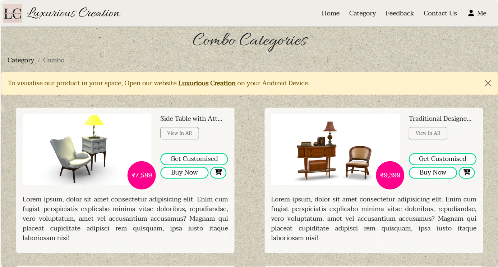
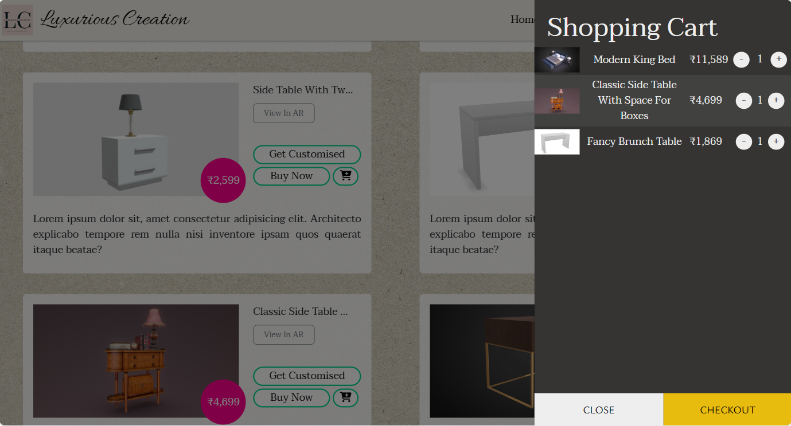

# 🖥️ Luxurious Creation - AR Furniture Shopping Website

Luxurious Creation is the **web version** of the Luxture app, offering an Augmented Reality (AR)-powered online furniture shopping experience. Built using **HTML**, **CSS**, **JavaScript**, **PHP**, and **Bootstrap**, it allows users to browse, preview, and purchase furniture directly from the web—no app installation required.

---

## 🧩 Problem Statement

Online furniture shopping often leads to dissatisfaction due to:

* Incorrect size and fit
* Mismatched design or color
* Limited product visualization on websites

This results in high return rates and poor user experience.

---

## ✅ Our Solution

Luxurious Creation solves this by enabling:

* **3D preview of furniture in the user's real environment (AR)**
* **Web-based access** without needing to download an app
* **Smooth browsing**, **product customization**, and **feedback collection**

---

## 🌐 Website Features

### 🛍️ Browse Furniture by Category

* Explore sofas, chairs, tables, beds, etc.
* Filter and search for specific styles

### 🧩 3D AR View

* Place furniture in your space using your mobile camera
* Rotate and scale the 3D model to check fit and aesthetics

### 🛒 Cart & Checkout

* Add items to cart
* View product details and pricing

### 🧾 Login & Registration

* Email/password authentication using PHP backend
* Save browsing history and past activity

### 🛠️ Customization & Feedback

* Fill a form to request customized furniture
* Submit reviews and feedback

---

## 🔧 Tech Stack Used

| Tech                       | Purpose                         |
| -------------------------- | ------------------------------- |
| **HTML5**                  | Page structure                  |
| **CSS3**                   | Styling and responsiveness      |
| **JavaScript**             | Interactivity and AR logic      |
| **PHP**                    | Backend processing, auth, forms |
| **Bootstrap**              | Responsive design and UI        |
| **3D Models (.glb/.gltf)** | AR product previews             |

---

## 📲 Try It Online

You can access Luxurious Creation directly from your browser:

**🌐 [Visit the Website](https://luxurious-creation.github.io/LuxuriousCreationWeb/)**

> ⚠️ Works best on mobile devices with ARCore/ARKit support

---

## 📸 Screenshots & Demo Video

* [Demo Video](https://drive.google.com/file/d/1I36ZEh3EZvrzxtZUA095MnxTGIsDMuYU/view?usp=drive_link)
* 
* 
* 
* 
* 
* 
* 
* 
* 

---

## 🚀 Key Benefits

1. **No App Download Needed**
2. **Interactive Shopping with 3D AR Views**
3. **Real-time Product Customization Requests**
4. **User Login for Saving Activities**
5. **Feedback Collection for Improvement**

---

## 📈 Future Improvements

* Online payment gateway integration
* Live chat support for customization
* Order tracking dashboard

---

## 👨‍💻 Developer Note

> Luxurious Creation expands on the Luxture mobile app by offering the same AR-driven experience via the web, making it even more accessible to users without needing to install anything.

---

## 🔐 License

This project is licensed under the MIT License.
